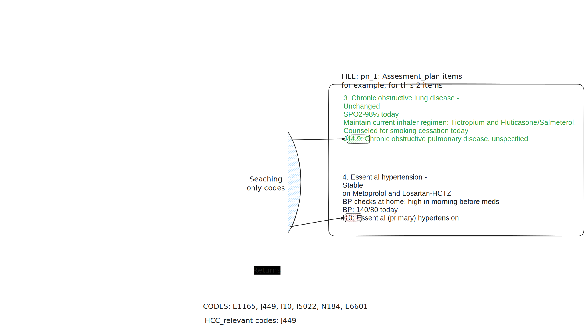

## HCC Assignement:

### 1. Draft
This is a simple Regex matching that retrieves HCC codes in O(1) from the dictionary, only by searching the codes via pattern matching.

To be especific:
- O(1): To search the code within the dictionary from `HCC_relevant_codes.json`
- O(n): To extract codes from the progress notes, where `n` is the number of lines of each note.



### 2. Folder structure
```sh
|-- AI Engineer Technical Test.pdf
|-- HCC_relevant_codes.csv
|-- README.md
|-- convertCSVtoDictionary.py
|-- data.json
|-- progress_notes
|   |-- pn_1
|   |-- pn_2
|   |-- pn_3
|   |-- pn_4
|   |-- pn_5
|   |-- pn_6
|   |-- pn_7
|   |-- pn_8
|   `-- pn_9
|-- relevantHCCcodes.py
```

### 3. Convert the CSV to a python hash table for `O(1)` search

Run
```sh
python convertCSVtoDictionary.py
```

This generates the file `HCC_relevant_codes.json` that has a hash table with this structure:
```json
{
    "ICD-10-CM Codes": "Description",
    "A0104": "Typhoid arthritis",
    "A0105": "Typhoid osteomyelitis",
    "A021": "Salmonella sepsis",
    "A0223": "Salmonella arthritis",
    "A0224": "Salmonella osteomyelitis",
    "A065": "Amebic lung abscess",
    :
}
```

### 4. Relevant codes extraction
#### 4.1. Function `extract_codes`
This function extract all the codes from a progress note file in `./progress_notes`

For `./progress_notes/pn_8`, the output looks like this (`extracted codes`):
```sh
['E109', 'G43909', 'G4733', 'I10', 'E785', 'K219', 'F329']
```
#### 4.2. Function `check_key_in_json`
This function evaluates if the `extracted codes` fall inside the HCC relevant codes (keys on the dictionary within `HCC_relevant_codes.json`)

The HCC codes for `./progress_notes/pn_8` looks like this:
```sh
['E109']
```

### 5. How to run it
Change what progress_note to analyze setting the path to the file in `pn_to_analyze = "progress_notes/pn_9"` of `relevantHCCcodes.py` and run:

```sh
python relevantHCCcodes.py
```
Outputs: 
```sh
['E109']
```