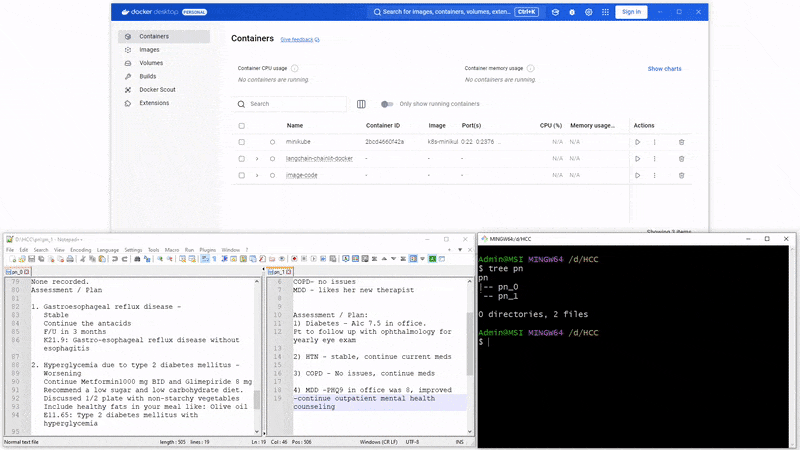
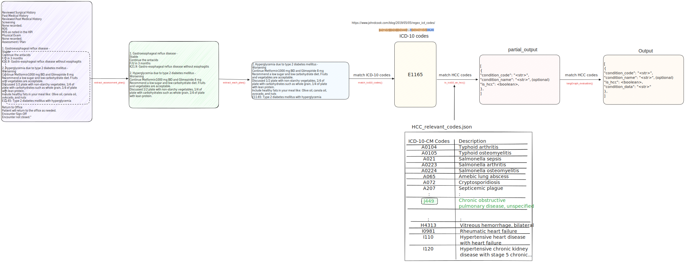
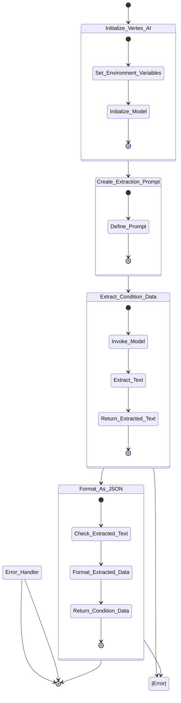

## HCC

<div align="center">
    
</div>


<div align="center">
Watch the video demo <a href="./assets/videos/demo_HCC.mp4">here 🎥</a> 
</div>

### 1. Overview
The following implementation is divided in a set of regex layers, a hash table comparision to validate HCC codes and a LangGraph pipeline. In a nutshell, several progress notes are analyzed and the final output after the analysis process is:
```
    {
        "condition_code": "<str>",
        "condition_name": "<str>",
        "is_hcc":         "<boolean>",
        "condition_data": "<str>"
    },
```
Being the value of `is_hcc` True or False if it the code found in the progress note is relevant to HCC or not.
The transition between layers is made in 5 phases determined by the following functions:
- `extract_assessment_plan()`: Extracts the assessment plan section from progress note file
- `extract_each_plan()`: Extracts an individual assessment plan from the assessment plan section
- `match_icd10_codes()`: Extract ICD-10 patterns/codes (ICD-10 can be considered as a superset<sup>1</sup> of HCC codes)
- `is_icd10_an_hcc()`: Determines if the ICD-10 patern is an HCC code. In this step we map the ICD-10 code to the `HCC_relevant_codes.json` file for a rapid search in O(1)
- `langGraph_evaluation()`: Extracts the condition_data from an assessment plan with Vertex AI model

>*1. Superset*: Extrictly speaking ICD-10 is not a superset of HCC, but HCC uses the nomenclature and codes from ICD-10. HCC groups codes in categories in a different fashion, but in terms of regex expression, it could be considered that ICD-10 is a superset of ICD-10.

The following Diagram depicts the layered approach and 



<div align="center">
    <b>Fig. 1.</b> Layered Implementation
</div>

> **Note: Hash table and dictionary are two words used indistinctly**

### 2. How to run it
- Create an `.env` file, and set your vertexai project_id, location, json credentials, and progress notes folder (being where main.py is the root directory), see a sample in `.sample.env`

    ```sh
    PROJECT_ID=
    LOCATION=
    CREDENTIALS_PATH=
    PROGRESS_NOTES_FOLDER=
    ```

- Build the docker image
    ```sh
    docker build -t hcc-image .
    ```

- Run the Docker container, mounting the result directory to access the output:
    ```sh
    docker run -v $(pwd)/result:/app/result hcc-image
    ```

### 3. Folder structure
```sh
.
|-- AI Engineer Technical Test.pdf
|-- HCC_relevant_codes.csv
|-- HCC_relevant_codes.json
|-- README.md
|-- __pycache__
|   |-- langgraph.cpython-311.pyc
|   `-- pipeline.cpython-311.pyc
|-- draft.excalidraw
|-- images
|   |-- 1-layers.svg
|   |-- 2-layers.svg
|   |-- full-layers.svg
|   `-- initial_draft.svg
|-- main.py
|-- pipeline.py
|-- poetry.lock
|-- progress_notes
|   |-- pn_0
|   |-- pn_1
|   |-- pn_2
|   |-- pn_3
|   |-- pn_4
|   |-- pn_5
|   |-- pn_6
|   |-- pn_7
|   |-- pn_8
|   `-- pn_9
|-- pyproject.toml
|-- samples
|   |-- input
|   `-- output
|-- tempCodeRunnerFile.py
|-- tests
|   `-- utils
|       `-- regex
|           |-- __pycache__
|           |   `-- test_regex_utils.cpython-311-pytest-8.3.5.pyc
|           `-- test_regex_utils.py
`-- utils
    |-- convertCSVtoDictionary.py
    |-- extras
    |   |-- test1.py
    |   |-- test2.py
    |   |-- test3.py
    |   |-- test4.py
    |   |-- test5.py
    |   |-- test6.py
    |   `-- test7.py
    |-- regex
    |   |-- HCC_relevant_codes.json
    |   |-- __init__.py
    |   |-- __pycache__
    |   |   |-- __init__.cpython-311.pyc
    |   |   `-- regex_utils.cpython-311.pyc
    |   `-- regex_utils.py
    `-- relevantHCCcodes.py
```

### 4. LangGraph Pipeline `pipeline.py`

This code defines a pipeline to process an **assessment plan** and extract **condition management data** using a combination of **Vertex AI** and a **StateGraph**. The main objective is to process the input assessment plan, extract relevant treatment or management details, and format them into a structured output (condition data). Below is a breakdown of how the code works:

---

#### 4.1. **GraphState Definition**
   - **GraphState** is a `TypedDict` that defines the state schema used throughout the LangGraph pipeline.
     - `assessment_plan`: The input text (assessment plan) to be processed.
     - `extracted_text`: The intermediate result containing the extracted information.
     - `condition_data`: The final output after formatting the extracted information.

#### 4.2. **Vertex AI Initialization**
   - **initialize_vertex_model()**: Initializes a **Vertex AI** model (using Google's Gemini model) with proper credentials and project settings.
   - The model is set to work in the **"us-central1"** location with a **temperature of 0**, ensuring deterministic responses.

#### 4.3. **Extraction Prompt Definition**
   - **create_extraction_prompt()**: A predefined prompt template that instructs the AI model to extract specific pieces of information from the assessment plan:
     - **Relevant information**: Medications, counseling, management instructions, diagnostic/testing plans, and referrals.
     - **Exclusion criteria**: Status descriptions, diagnostic codes, vital signs, and condition names.
   - This prompt structure helps guide the model's behavior and ensure consistency in extraction.

#### 4.4. **Extracting Condition Data**
   - **extract_condition_data()**: 
     - Takes the **assessment_plan** as input.
     - Invokes the Vertex AI model and applies the extraction prompt.
     - The model processes the input text and extracts the relevant management data.
     - If successful, the extracted text is returned as part of the updated state; if an error occurs, the state is updated with an empty string.

#### 4.5. **Formatting Extracted Text as JSON**
   - **format_as_json()**:
     - Checks if any text was extracted.
     - If present, it formats the extracted data into a JSON-compatible format (a list of strings).
     - It ensures that each extracted line is on a new line and non-empty lines are included.
     - Returns the formatted `condition_data` as a JSON string, ready for further use.

#### 4.6. **StateGraph Construction**
   - **create_graph()**:
     - Defines a state graph workflow using the **StateGraph** class.
     - The graph has two main nodes:
       - **extract_condition_data**: Extracts condition-related information from the assessment plan.
       - **format_json**: Formats the extracted text into a structured JSON output.
     - The nodes are connected, and the entry point of the graph is set to **extract_condition_data**.

#### 4.7. **Main Pipeline Function**
   - **langGraph_evaluation()**:
     - This is the main pipeline function.
     - It takes an **assessment_plan** as input (a string) and returns the **condition_data** extracted from the input plan.
     - It validates that the input is a string.
     - The pipeline invokes the graph and returns the formatted output, ensuring the correct type of output is returned (either a list or an error message).
     - In case of errors, the function catches exceptions and returns a detailed error message.

The following State diagram shows connection between nodes:



<div align="center">
    <b>Fig. 2.</b> Pipeline Graph of `langGraph_evaluation()
</div>

### 5. Convert the CSV to a python hash table for `O(1)` search

Run
```sh
python convertCSVtoDictionary.py
```

This generates the file `HCC_relevant_codes.json` that has a hash table with this structure:
```json
{
    "ICD-10-CM Codes": "Description",
    "A0104": "Typhoid arthritis",
    "A0105": "Typhoid osteomyelitis",
    "A021": "Salmonella sepsis",
    "A0223": "Salmonella arthritis",
    "A0224": "Salmonella osteomyelitis",
    "A065": "Amebic lung abscess",
    :
}
```

### 6. How to set it up locally
Create the virtual enviroment and install the packages
```sh
poetry install

```
Activate the environment
```sh
poetry shell
```

Or

```sh
source .venv/Scripts/activate
```

### 7. How to run it locally
- Create an `.env` file, and set your vertexai project_id, location, json credentials, and progress notes folder (being where main.py is the root directory), see a sample in `.sample.env`

    ```sh
    PROJECT_ID=
    LOCATION=
    CREDENTIALS_PATH=
    PROGRESS_NOTES_FOLDER=
    ```

- After the python packages have been install with poetry (step 6.), run the script locally

    ```sh
    python main.py
    ```

>Note: Verify that the folder to analyze is defined in the parameter `root_folder` within the main.py file. The output will be stored in the `result/output` file

### 8. Tests

Run
```sh
pytest
```

### 9. TO-DO
- [X] `► Functionn to extract codes`
- [X] `► Functionn to convert a *.csv file to a python hash table`
- [X] `► Function to search in a HCC hash table`
- [X] `► Work on a layered approach`
- [X] `► Verify error handling where it's missing`
- [X] `► Edge cases missing: pn_6 and pn_7`
- [X] `► Dockerize in a container`
- [X] `► Create a volume in the container app/result to store the output`
- [x] `► Move sensitive data to a .env file`
- [x] `► Test functions missing`
- [x] `► Video demo`
